  

---

 

### 👨‍💻 Neural Pathways & Vision

> **CURRENT STATUS:** Architecting the future with untethered curiosity.

* 🎓 **The Origin:** A 20-year-old tech architect with a massive vision for the future of AI and robotics.
* 🚀 **Current Mandate:** Building scalable B2B & B2C products and complete digital ecosystems at **Pixra**.
* 🧠 **Core Engineering:** Deep-diving into **C++** to architect high-performance, resilient systems and next-generation Search Engines.
* 🤖 **The Endgame:** Transitioning into deep-tech research to build climate-resilient, highly intelligent **Humanoids** that can assist humanity.

 

### ⚙️ Technology Arsenal

  

 

### 📊 System Telemetry (Solid Dark)

  

<table align="center" border="0" cellpadding="0" cellspacing="0" width="100%">
  <tr>
    <td align="center" width="50%">
      
    </td>
    <td align="center" width="50%">
      
    </td>
  </tr>
</table>

 

### 🌌 Architectural Contributions

  <picture>
    <source media="(prefers-color-scheme: dark)" srcset="https://raw.githubusercontent.com/Radhebharadwaj/Radhebharadwaj/output/github-contribution-grid-snake-dark.svg">
    <source media="(prefers-color-scheme: light)" srcset="https://raw.githubusercontent.com/Radhebharadwaj/Radhebharadwaj/output/github-contribution-grid-snake.svg">
    
  </picture>

 

  <b style="color: #a3a3a3;">🌍 Ready to build the future. Establish a secure connection:</b>  
  
  
  

